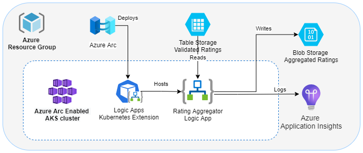

# Introduction

This guide presents an example of an Azure Logic App operating on an Arc-enabled Kubernetes cluster. The Logic App performs periodic checks on Azure Table Storage for newly added rating items. Any fresh ratings are appended to a JSON file within Azure Blob Storage, consolidating all product ratings.



## Deployment Process for Azure

1. Launch Visual Studio Code (VS Code) and access the `arc-enabled-logic-app-sample` folder.
2. Reopen the window within a development container, which requires Docker and the [Remote Development Extension](https://marketplace.visualstudio.com/items?itemName=ms-vscode-remote.vscode-remote-extensionpack) to be installed. This container comes with all the necessary preinstalled tools and CLI extensions. In case the development container cannot be opened, verify the prerequisites in the `./devcontainer/Dockerfile`.
3. Log in to your Azure subscription using `az login`.
4. Navigate to the `arc-enabled-logic-app-sample/env` directory.
5. Execute the following command to enable the essential resource providers in your subscription:

    ```bash
    ./deployFeatureRegister.sh
    ```

6. Open the `environment-variables.sh` file and provide a value for the `basename` variable. This value will be utilized to generate names for other resources.
7. Load the values by running `source environment-variables.sh` in your terminal. The script will check the validity of the storage account name and output "Storage name is not valid" if it's invalid. The result will be stored in the `STORAGE_NAME_VALID` variable. If the value is `false`, select a different and unique name for the resource group and try again, unless you plan to reuse the existing storage account.
8. Create a compliant AKS cluster with a public static IP address, Arc connection, and App Service Arc extensions by executing:

    ```bash
    source ./provisionKubernetesHostInfra.sh
    ```

9. Provision the App Service components and deploy the logic app using:

   ```bash
   source ./deploy.sh
   ```

The script will display the portal URLs for the Logic App and the Storage Account. Additionally, the deployment script will populate the *ratings* table with an initial value. You can access the resulting logic app runs and data in the *ratings* table and blob containers using these URLs.

## Azure Testing

Once the app is successfully deployed to Azure, you can upload data to the *ratings* table in Azure Table Storage and view the results in Azure Blob Storage.

1. Use the [Azure Storage Explorer](https://azure.microsoft.com/features/storage-explorer/) to connect to the storage account outputted by the deploy script.
   > If Azure Storage Explorer is unavailable, refer to the `deploy.sh1` file for an example of using Azure CLI to interact with table storage.
2. Open the ratings table.
3. Click the `Import` button.
4. Import the `ratings.csv` file from the `data` folder within the workspace.
5. Access the Logic app in the Azure portal using the URL provided by the deployment script.
6. Open the `RatingsWorkflow` workflow.
7. Wait for a new run to complete.
8. Open the run and view the results.
9. Refresh the ratings table in the Azure Storage Explorer. The ratings' `publishDate` field should now display the time when the workflow ran.
10. Open the `ratings` blob container in the same storage account.
11. Access the blob named `3`. This blob contains the ratings from the ratings table.
